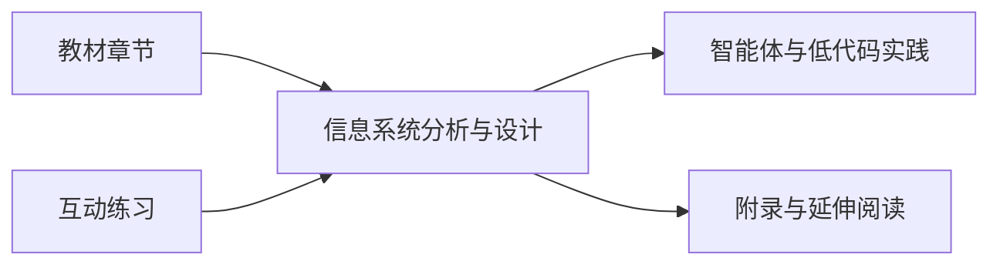

<div align="center">

# 信息系统分析与设计

**ISAD · 数字教材**

苏州大学课程配套资源<br>
面向信息资源管理专业本科生

[在线教材](https://dsdh-python.github.io/ISAD/)　 / 　[教材章节](html教材/index.html)　 / 　[互动练习](games/)

</div>

---

围绕信息系统分析与设计方法，结合智能体与低代码（扣子 Coze）案例，连接课程知识、互动练习与实践探索。

## 学习路径



## 资源

### 教材与练习

- [教材门户及第 1–9 章](html教材/)
- [各章互动练习](games/)
- [课程附录](pages/appendix.html)
- [智能体创新实践汇编思维导图](pages/智能体创新实践汇编_思维导图.html)

### 案例与参考

- [前沿文献候选清单](media/前沿文献_候选清单.md)
- [AI 蓝皮书](media/AI蓝皮书.md)
- [智能体创新实践汇编：案例提取](media/智能体创新实践汇编_案例提取.md)
- [职业与资格速查表](media/职业与资格速查表.docx)
- [教材配图](images/) · [操作截图与案例素材](media/)

### 项目与工具

- [Git 与 VS Code 使用说明](github+VScode.md)
- [全站样式](style.css) · [全站交互](app.js)
- [已归档章节与附录旧网址跳转页](pages/legacy/)

## 项目说明

根目录 [index.html](index.html) 是 GitHub Pages 首页入口，会跳转至教材门户。章节和附录正文分别位于 `html教材/` 与 `pages/`；旧网址跳转页位于 `pages/legacy/`。教材章节通过相对路径引用根目录中的样式、脚本、图片、媒体和练习，请勿删除仍被页面引用的资源。根目录只保留首页，旧的根路径章节及附录网址不再使用。

## 许可

- 课程材料的版权与使用限制见 [LICENSE](LICENSE)。
- 教材中派生自 yeasy《智能体 AI 权威指南》v1.0.0 的内容按 [CC BY-NC-SA 4.0](https://creativecommons.org/licenses/by-nc-sa/4.0/) 使用。再利用时须遵守署名、非商业使用和相同方式共享要求。

## 维护与发布

修改后检查网页资源路径和章节导航：

```bash
git status
git diff --check
```

推送到 `main` 后，GitHub Actions 会自动发布站点。
